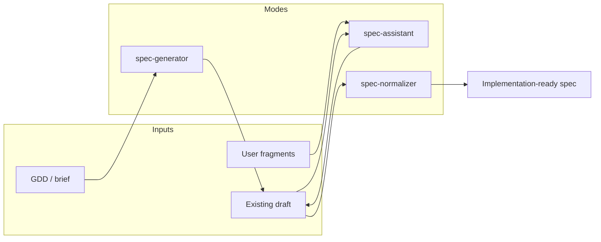

# Specification Document Regulation

## 1. Purpose and scope

This regulation is the **top-level contract** for specification documents across the three pipeline modes:

| Mode | Primary document interaction |
|---|---|
| `spec-assistant` | fragment-capture: write; review-light / review-full: **read-only** until user approves fixes |
| `spec-generator` | first full draft from GDD/brief |
| `spec-normalizer` | implementation-ready normalized markdown |

**This file does not duplicate atomic pass checklists.** Verification details live in `./passes/PASS-*.md` and activation in `./pass-loading-policy.md`. File I/O: `.cursor/rules/rule-windows-source-files-and-encoding.mdc`.

Methodology depth: `./core-principles/system-thinking.md`, `./core-principles/decomposition.md`, `./core-principles/grounding.md`.

---

## 2. Document role

A specification is a **connected system description** for implementers and coding agents:

- what the feature is and is not;
- terminology, decomposition, data, flows, constraints;
- explicit decisions, open questions, and conflicts;
- (after normalization) machine IDs and traceability.

It is not a GDD retelling, marketing copy, or code dump.

---

## 3. Three-mode pipeline (high level)



- **Assistant** — never replaces user authorship on small steps; **review submodes are read-only** on the spec file (findings + proposed fixes in chat; file edits only after explicit user request to apply). Fragment-capture writes per §6.
- **Generator** — transforms design into system-layered technical spec; no invention.
- **Normalizer** — structure, IDs, registry, matrix, readiness verdict; hard gates `PASS-008`/`PASS-009`.
- **Write boundary** — pipeline writes are limited to `SPECIFICATION_PATH`; during `new`, the parent documentation directory may be created. Code and project files are never write targets.

Mode transition rules: `../policies/mode-transition-guards.md`.

---

## 4. Core operating rules

1. Treat the spec as a system (see core principles), not a flat bullet list.
2. Place each fragment in its **canonical section**; track cross-section impact.
3. Preserve requirement strength on edit, merge, or deduplicate (`PASS-001`, `PASS-010`).
4. Separate **confirmed requirements**, **proposals**, **assumptions**, **issues**, and **open questions**.
5. Never fill gaps by guesswork; label `Assumption` or `Open Question`.
6. Ground every significant system/decomposition item into a concrete project-domain object using explicit project rules, project analysis, or `./core-principles/grounding.md`; the final decomposition tree itself must be grounded, not only annotated.
7. User-facing pipeline language and specification body content use required `USER_LANGUAGE`; structural specification metadata and machine/project identifiers stay English where required for navigation or implementation (`PASS-*`, `REQ-*`, `AC-*`, finding `id`, API names, paths, files, folders, class/method/variable names, namespaces, config keys, Unity/C# terms, code snippets).
8. **Review vs edit:** `review-light` and `review-full` must not mutate `SPECIFICATION_PATH` during the review run; proposed fixes stay in the user report until the user asks to apply them (`../policies/mode-transition-guards.md` §4.3).
9. **Documentation-only writes:** do not create, edit, delete, move, rename, format, patch, or otherwise mutate source code, assets, configs, tests, generated project files, project metadata, or any non-documentation project file.

---

## 5. Canonical shape (working / generator draft)

Use when building a full working document (generator or mature assistant draft):

```md
# <Feature / Module Name>

## 1. Goal and Concept
## 2. Context and Scope Boundaries
## 3. Terminology and Glossary
## 4. System Decomposition
## 5. Data Models
## 6. System Diagram
## 7. User / Core / Behaviour Flows
## 8. Implementation Constraints
## 9. Mandatory Implementation Approach (if required)
## 10. Forbidden Formal Solutions (if required)
## 11. Open Questions
```

Rules:

- omit or leave empty sections without inventing filler;
- configs belong inside decomposition, not as an orphan top-level junk section;
- concrete grounding details belong on the owning decomposition entity or implementation contract entry, not in a parallel top-level or §2 catalog;
- §2 Context and Scope Boundaries may contain only high-level project integration context: module boundary, external neighbors, major infrastructure touchpoints, and scope ownership; it must not duplicate the entity-by-entity grounding tree;
- terminology before decomposition when terms exist;
- terminology/glossary contains project/domain vocabulary only; Unity/C# API names and confirmed decomposition signatures stay in decomposition / implementation contract and are reused exactly as signatures, without duplicate glossary fields;
- decomposition entries and headings must be grounded as concrete project-domain entities/parts, not only abstract systems with `Grounded as` annotations (see `./core-principles/grounding.md`);
- **`## 11. Open Questions` is the only place for unresolved open questions** — use stable IDs (`OQ-001`, …); no per-entity “Open questions:” blocks, no `TBD` placeholders in decomposition/flows instead of an `OQ-xxx` entry.
- No subsections such as “Closed decisions”, “Resolved OQ”, or tables that archive answers already stated elsewhere.
- **`## 4. System Decomposition` is a grounded hierarchical tree** — L0 root → grounded L1 project/domain parts as nested headings → L2+ entities under their parent part → same-level interaction blocks; no flat “all entities in 4.3” list and no abstract analysis hierarchy (see `./core-principles/decomposition.md` §2.1).

**Normalizer output** uses the 20-section TOC defined in `../modes/spec-normalizer/pipeline/SKILL.md` — not this outline alone.

**Recommended §4 outline (generator / assistant draft):**

```md
## 4. System Decomposition

### 4.1. Level 0 — <feature / module>
<role, boundary, optional ASCII tree overview>
<Outside L0: external neighbors>

### 4.2. Level 1 — <subsystem A>
#### <entity A1>
#### <entity A2>
#### Interaction at level 1 (subsystem A)   <!-- when needed -->

### 4.3. Level 1 — <subsystem B>
#### <entity B1>
...
### 4.x. Interaction at level 0 (cross-subsystem)   <!-- when needed -->
### 4.x. Responsibility matrix                      <!-- optional -->
```

---

## 6. Fragment update protocol (summary)

For each incoming fragment:

1. Map to affected sections and entities.
2. Check terminology impact (`PASS-002`).
3. Check grounding and conflicts (`PASS-003`).
4. Check data, flow, lifecycle, ownership impact (`PASS-004`–`PASS-006` when in scope).
5. Check weakening and dedup risk (`PASS-001`, `PASS-010`).
6. Record unresolved items as `OQ-xxx` / issues in **`## 11. Open Questions`** (or §17/§18 after normalization) — not inline under decomposition entities or flows as `TBD` prose.

Do **not** rewrite the entire document unless the user requests full regeneration.

Detailed fragment response format: `../modes/spec-assistant/fragment-capture/SKILL.md`.

When the user answers an open question, follow **§7 Open question resolution** (not only the fragment protocol above).

---

## 7. Open questions — placement and resolution

### 7.1 Unresolved (registry only)

While a question has **no** confirmed answer:

1. Add or keep one entry in **`## 11. Open Questions`** (draft) or **`## 18. Open Questions`** (normalized) with ID `OQ-xxx`, blocking/non-blocking if known, and affected section/entity named in the entry text.
2. **Do not** duplicate the question under decomposition entities, flows (`TBD`), responsibility matrices, diagrams, data model bullets, or entity cards.
3. **Do not** put `OQ-*` IDs or `Related OQ` references in canonical body sections. If a body section cannot state a fact yet, use neutral unresolved wording only (for example `Project placement unresolved`) and put the actual question text and ID in the Open Questions section.

### 7.2 Resolved (inline answer, remove from registry)

When the user (or a higher-priority source) **closes** an open question:

1. **Integrate inline** — write the **answer** as normative text in the canonical section (flows, constraints, decomposition, data models, integration, `REQ-*` / contract text after normalization, etc.). The body of the spec is the source of truth for implementers.
2. **Remove from the open list** — delete the OQ entry from `## 11. Open Questions` (draft) or `## 18. Open Questions` (normalized). If none remain, state briefly that there are no open questions (or leave the section empty with an explicit N/A note).
3. **Do not archive closed OQs in the spec** — forbidden patterns include:
   - “Closed decisions”, “Resolved questions”, “Answered OQ” tables or bullet lists;
   - duplicating the same answer in Open Questions and in the body;
   - keeping a historical OQ ID block whose only purpose is to record the chat answer;
   - leaving `Related OQ`, `Linked decision`, `Связанные решения: OQ-...`, or equivalent cross-references in canonical sections after the question is closed.
4. **Traceability without clutter** — after normalization, record closure once in `## 3. Source Preservation Notes` (e.g. `OQ-003 → REQ-012 §8`) when an ID existed; do not recreate a second copy of the requirement text there.
5. **`## 15. Explicit Decisions` (normalized)** — use only for decisions that **do not** map cleanly to a single functional/contract section (accepted risk, scope cut, product choice with no natural FR home). It is **not** a graveyard for closed open questions.

Chat/handoff may summarize *which sections changed*; it must not introduce a parallel “closed decisions” list that replaces inline spec text.

---

## 8. Entity and decomposition (pointer)

Entity format, responsibility matrix, and depth triggers are defined in:

- `./core-principles/decomposition.md` — levels, entity template, when to split;
- `./core-principles/system-thinking.md` — layers, flows, anti-patterns;
- `./core-principles/grounding.md` — project-context grounding from abstract systems to real domain objects.

Generator applies second-pass responsibility mapping in `../modes/spec-generator/system-mapping/SKILL.md`.

If decomposition records a concrete type, method, property, field, event, or API signature, that signature is the canonical way to mention the entity across the document. Do not create a parallel glossary/TERM-* row for the signature itself; use terminology only for the domain concept behind it when such a concept needs definition.

---

## 9. Data, diagrams, and behaviour (pointer)

Data models, diagrams, and behaviour flows follow core principles and `PASS-004`–`PASS-006`, `PASS-005`. Generator detail: `../modes/spec-generator/flow-data-modeling/SKILL.md`.

---

## 10. Review focus (regulation level)

Always screen for (execute via passes, do not re-list checks here):

- duplicates with hidden extra conditions;
- contradictions;
- vague shortcut-friendly wording;
- missing owner / trigger / failure behavior;
- terminology drift;
- assumptions presented as facts.

Review profiles: `../review-profiles/review-light.md`, `../review-profiles/review-full.md`.

Findings format: `./pass-loading-policy.md` section 6.

---

## 11. Normalized document expectations (pointer)

Normalizer-owned: 20-section TOC, Source Preservation Notes, `REQ-*` / `AC-*` / `TERM-*` registry, traceability matrix, readiness verdict. See `../modes/spec-normalizer/pipeline/SKILL.md`, `addressability-traceability/SKILL.md`. Gates: `PASS-008`, `PASS-009`.

---

## 12. Constraints (all modes)

Do not:

- create, edit, delete, move, rename, format, patch, or otherwise mutate source code, assets, configs, tests, generated project files, project metadata, or any non-documentation project file;
- redirect writes to another file during a pipeline run; another documentation target requires a separate invocation with its own `SPECIFICATION_PATH`;
- invent mechanics, architecture, APIs, or integrations;
- convert suggestions into requirements without confirmation;
- hide conflicts by soft merging;
- replace concrete contracts with abstract prose;
- create a separate "Project grounding", "Repository grounding", "Приземление в проекте", or equivalent subsection/table that duplicates entity placement, signatures, DI/composition, config, persistence, or API details instead of placing them on the owning §4 decomposition entries;
- leave "system" abstractions ungrounded when a project-domain object, owner, behavior, parameter owner, or placement can be identified;
- keep an old abstract system-thinking decomposition and call it grounded only because entity cards contain `Grounded as`;
- drop mandatory gates in normalizer for compactness (`./pass-loading-policy.md` section 5);
- close an open question by appending a “resolved / closed decisions” list instead of editing the canonical section (see §7);
- leave unresolved questions as per-entity “Open questions”, inline `TBD`, `Related OQ` references, body-level `OQ-*` IDs, or an empty §11 while §4/§7 still contain unknowns (see §7.1).

---

## 13. Source priority and pass pointers

Source conflicts: `../source-priority-policy.md` → findings via `PASS-003`. Check steps: `./passes/PASS-*.md`. Activation: `./pass-loading-policy.md`. Review order: `../review-profiles/*.md`. Routing: `../router/router-map.md`.

**DRY rule:** mode SKILL files orchestrate; they do not copy pass checklist text.
